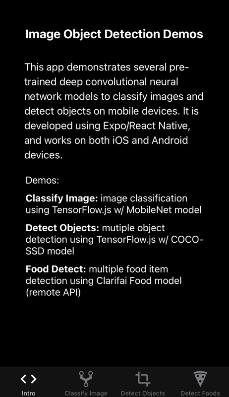
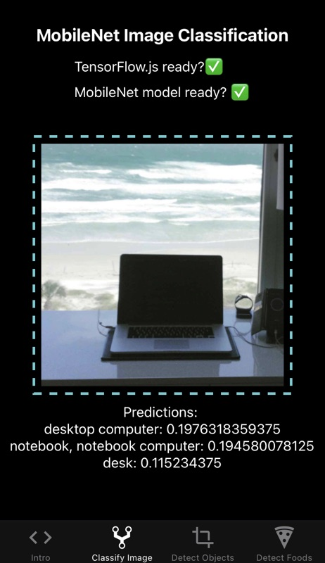
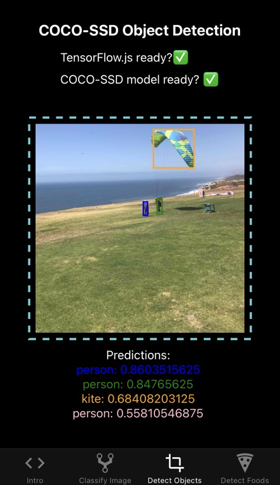
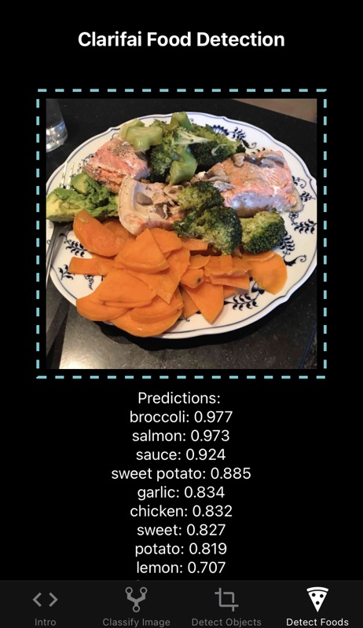

# Image Recognition and Object Detection with React Native/Expo

This React Native/Expo app demonstrates several pre-trained deep convolutional neural network models to classify images and detect objects on iOS and Android mobile devices.

---

## Available Demos:

* __Classify Image:__ image classification using TensorFlow.js w/ MobileNet model (on device - model will take a few seconds to initialize)

* __Detect Objects:__ mutiple object detection using TensorFlow.js w/ COCO-SSD model (on device - model will take a few seconds to initialize)

* __Food Detect:__ multiple food item detection using Clarifai Food model (remote API) *

 ---

## Screenshots:

 ---

## To Run:
1. `yarn install`
2. `yarn start (or expo start)`

_\* To run the "Food Detect" demo, sign up for a free account at https://clarifai.com, obtain an API key, copy `.env.example` file to `.env` and add the API key. Make sure to verify your email address otherwise they will limit your account to 100 requests._

---

## Adapted From:
https://medium.com/p/deep-learning-for-detecting-objects-in-an-image-on-mobile-devices-7d5b2e5621f9